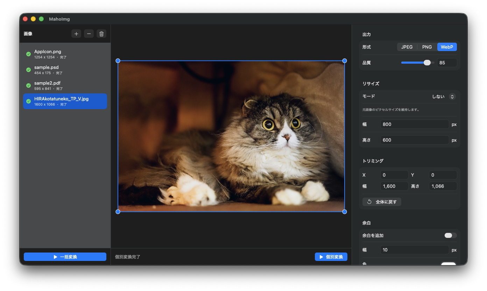

# MahoImg


MahoImg は、画像や PDF をまとめて変換するための macOS アプリです。JPEG、PNG、WebP への書き出し、リサイズ、トリミング、余白追加、ファイル名の接頭辞/接尾辞付けができます。

MahoImg is a macOS app for converting images and PDFs in batches. It can export to JPEG, PNG, or WebP, resize files, crop previews, add padding, and apply filename prefixes or suffixes.



## できること / What It Does

- JPEG、PNG、WebP、HEIC/HEIF、TIFF、PSD、PSB、PDF を読み込めます。
- JPEG、PNG、WebP に書き出せます。
- 複数ファイルやフォルダをまとめて追加できます。
- PDF はページを選んで 1 アイテムとして追加するか、全ページを個別アイテムとして追加できます。
- PSD/PSB は統合済みの静止画として書き出します。
- 画像を指定サイズに収める、幅だけ指定する、高さだけ指定する、強制的に幅高さを合わせる、といったリサイズができます。
- プレビュー上でトリミング範囲を調整できます。
- 余白と余白色を指定できます。
- 元ファイルと同じ場所、または選択したフォルダに保存できます。
- 同名ファイルがある場合は、標準では連番を付けて上書きを避けます。

- Imports JPEG, PNG, WebP, HEIC/HEIF, TIFF, PSD, PSB, and PDF files.
- Exports to JPEG, PNG, or WebP.
- Adds multiple files or folders at once.
- For PDFs, you can add one selectable-page item or add every page as a separate item.
- Exports PSD/PSB files as flattened still images.
- Supports several resize modes: fit inside a size, width only, height only, exact width and height, and more.
- Lets you adjust the crop area in the preview.
- Can add padding with a selected color.
- Saves next to the original file or into a selected folder.
- Avoids overwriting files by adding sequence numbers by default.

## 使い方 / How To Use

1. アプリを開きます。
2. 左上の `+` ボタン、またはウィンドウへのドラッグ&ドロップで画像やフォルダを追加します。
3. 右側のパネルで出力形式、品質、リサイズ、トリミング、余白、保存先、ファイル名を設定します。
4. PDF が複数ページの場合は、追加時に「ページを選んで追加」または「全ページを追加」を選びます。
5. 左サイドバー下部の `一括変換` を押すと、リスト内のすべての画像を変換します。
6. プレビュー下部の `個別変換` を押すと、現在選択中の画像だけを変換します。
7. 失敗した場合は、左側のリストに赤字で理由が表示されます。

1. Open the app.
2. Add images or folders with the `+` button or by dropping them onto the window.
3. Use the right-side panel to choose output format, quality, resize, crop, padding, save location, and filename options.
4. For multi-page PDFs, choose either "add as one selectable-page item" or "add every page".
5. Press `一括変換` at the bottom of the left sidebar to convert every image in the list.
6. Press `個別変換` below the preview to convert only the currently selected image.
7. If conversion fails, the reason appears in red in the left-side list.

## ImageMagick のインストール / Installing ImageMagick

WebP 書き出しなどの変換処理には ImageMagick が必要です。Homebrew を使っている場合は、ターミナルで次を実行してください。

ImageMagick is required for conversion tasks such as WebP export. If you use Homebrew, run the following command in Terminal.

```sh
brew install imagemagick
```

インストール後、次のコマンドで確認できます。

After installation, you can check it with:

```sh
magick -version
```

MahoImg は `/opt/homebrew/bin/magick`、`/usr/local/bin/magick`、PATH 上の `magick` の順に ImageMagick を探します。Homebrew が入っていない場合は、先に [Homebrew](https://brew.sh/) をインストールしてください。

MahoImg looks for ImageMagick at `/opt/homebrew/bin/magick`, `/usr/local/bin/magick`, then `magick` on PATH. If Homebrew is not installed, install [Homebrew](https://brew.sh/) first.

## 初回起動時の警告 / First Launch Warning

GitHub Release からダウンロードしたアプリを初めて開くと、macOS が「Apple は、MahoImg.app にマルウェアが含まれていないことを検証できませんでした」という警告を表示する場合があります。

If you downloaded the app from GitHub Releases, macOS may show a warning saying Apple could not verify that `MahoImg.app` is free of malware.

開けない場合は、次の手順で許可してください。

If the app cannot be opened, allow it with these steps:

1. `MahoImg.app` を一度開こうとして、警告を表示します。
2. `キャンセル` を押します。
3. macOS の `システム設定` を開きます。
4. `プライバシーとセキュリティ` を開きます。
5. 下部に表示される `MahoImg.app` の警告で、`このまま開く` を押します。
6. もう一度確認が出たら、`開く` を押します。

1. Try to open `MahoImg.app` once so macOS shows the warning.
2. Press `Cancel`.
3. Open macOS `System Settings`.
4. Open `Privacy & Security`.
5. In the warning for `MahoImg.app` near the bottom, press `Open Anyway`.
6. If macOS asks again, press `Open`.

これは未 notarize の個人配布アプリで表示される macOS の保護機能です。

This is a macOS protection feature shown for personally distributed apps that have not been notarized.

## 注意点 / Notes

- WebP 書き出しには ImageMagick が必要です。
- 保存先フォルダが存在しない場合、変換は失敗します。保存先を選び直してください。
- PDF はアプリ内で一度画像化してから変換します。細かいベクター情報は出力画像の解像度に依存します。
- PSD/PSB はレイヤーごとではなく、統合済み画像として扱います。

- ImageMagick is required for WebP export.
- Conversion fails if the selected output folder does not exist. Choose the save folder again.
- PDFs are rasterized before conversion, so fine vector details depend on the output image resolution.
- PSD/PSB files are treated as flattened still images, not layer-by-layer animations.

---

## Developer Notes / 開発者向け情報

### Requirements

- macOS 14 or later
- Swift 6 toolchain / Xcode command line tools
- ImageMagick at `/opt/homebrew/bin/magick`, `/usr/local/bin/magick`, or on PATH

Check WebP support:

```sh
magick -version
```

The `Delegates` line should include `webp`.

### Development

```sh
swift run MahoImg
```

### Test

```sh
swift test
```

### Build App Bundle

```sh
chmod +x scripts/build-app.sh
scripts/build-app.sh
open dist/MahoImg.app
```

The app version is stored in `VERSION`. `scripts/build-app.sh` reads that file and writes it into `CFBundleShortVersionString`.

The app icon source is `Assets/AppIcon.png`; the generated macOS icon file is `Assets/AppIcon.icns`.
